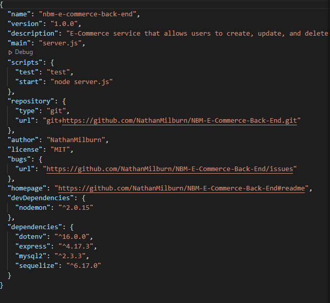
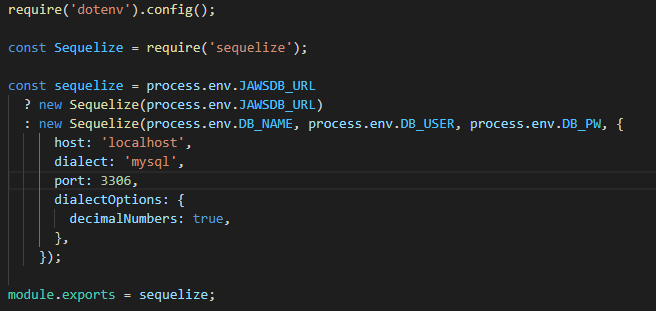
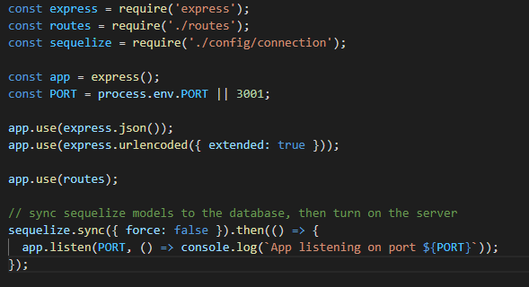
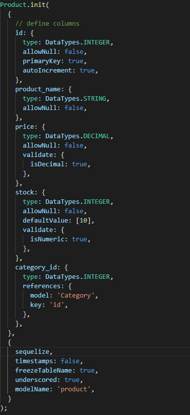
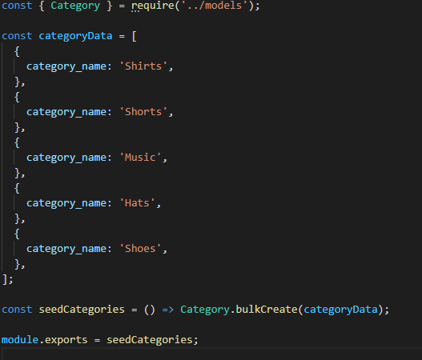

# NBM-E-Commerce-Back-End

## USER STORY

    AS A web developer
    I WANT to create the backend framework of an e-commerce brand that allows users to easily sort through database tables and information
    SO THAT they can properly manageinventory data foudn in their brand's database.

## TABLE OF CONTENTS

- [DESCRIPTION](#description)
- [INSTALLATION](#installation)
- [LICENSE](#license)
- [CONTRIBUTING](#contributing)
- [QUESTIONS](#questions)

## DESCRIPTION
Backend development application that allows users the ability to update, add or remove products and tags through various request methods like GET, POST, DELETE, and PUT.

## APPLICATION IN USE

LINK TO APPLICATION IN USE VIDEO
[WATCHVIDEOHERE](https://www.youtube.com/watch?v=lw2GQYVozJ0 "Video of application in use")

## INSTALLATION

This application requires the dotenv, express, mysql2, and sequelize packages to run on an express server and use SQL/sequelize syntax to easily request information from the database.

Package-JSON Modules:

Connection Setup:

Server.js Structuring:

Index Routes:

Model Example:

Seeds Example:

## LICENSE

The license included for the project is under MIT

## CONTRIBUTING

Week 13
https://uwa.bootcampcontent.com/UWA-Bootcamp/uw-blv-virt-fsf-pt-12-2021-u-c/-/tree/master/13-ORM

## QUESTIONS

If you have any further questions about this module or improvement ideas, please feel free to connect on either GitHub or LinkedIn, or email me at:

- GitHub: https://github.com/NathanMilburn
- LinkedIn: https://www.linkedin.com/in/nathan-milburn-55487513a/
- E-Mail: nathan.milburn@outlook.com